# 執行環境
在 vscode 中執行 jupyter notebook
# 程式語言
Python3.12.5
# 執行方式
需要使用 jupyter notebook 跑 pa2.ipynb 這個檔案。選擇正確的核心(如圖中venv(Python 3.12.5))後就可以點擊全部執行按鈕。
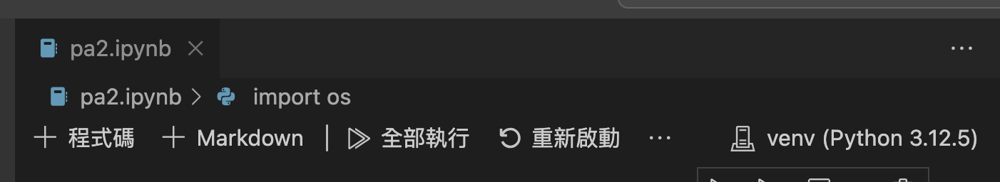
## 非原生套件
在執行之前需要安裝以下套件(pip3 install)：
```
nltk -> 用於 Stemming
pandas -> 用於操控資料
numpy -> 用於進行資料運算
tqdm -> 視覺化觀看程式執行進度
ipykernel -> 用於在 vscode 中執行 jupyter notebook
```
# 作業處理邏輯 
## Step 1 讀取檔案
首先將 data 目錄下所有的 txt 檔載入後存在字典，並將字典轉為 dataframe 方便之後進行資料處理。
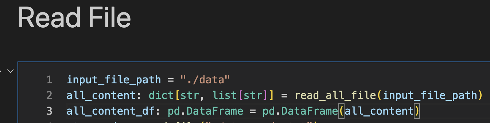
## Step 2 文字前處理
對 dataframe 裡面的每一個文章進行文字前處理，處理步驟為：

1. 移除標點符號
2. 移除數字
3. 轉為小寫
4. 移除 stopwords
5. 進行 stemming

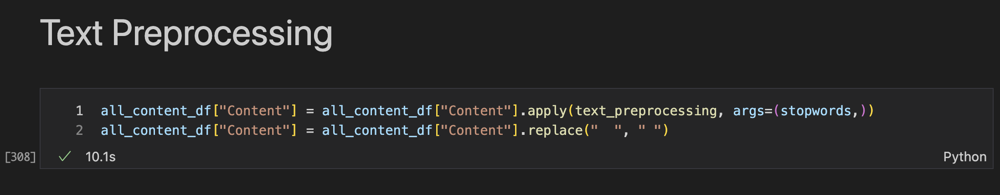
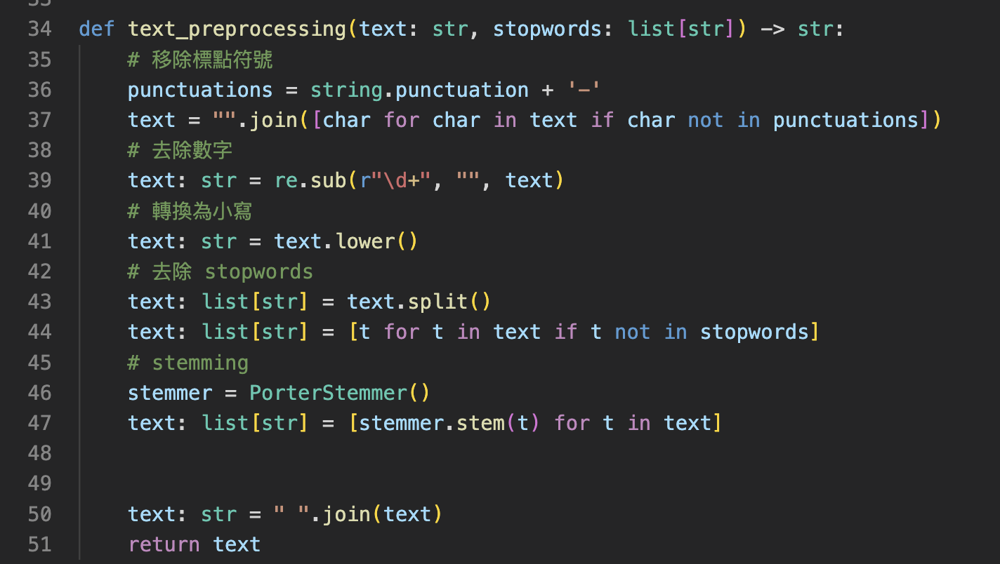

## Step 3 計算 Document Frequency (DF)

將每篇文章一個一個抓出來，先移除掉重複的字，然後將有出現過的 term 加 1，沒出現過的 term 就賦予 1。這樣就能得到一個 term 在所有文章出現過的次數。接著在根據 term 進行排序。然後就可以輸出成檔案。

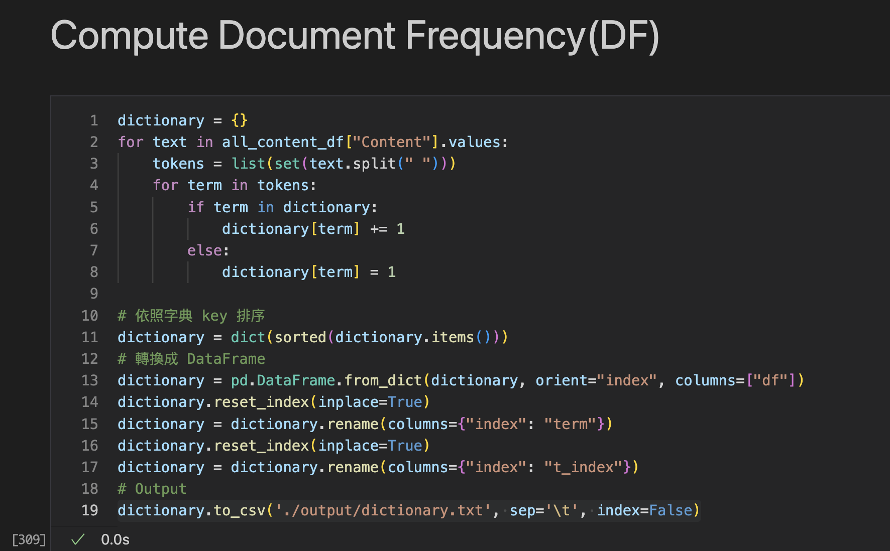

輸出後的檔案如下圖，column 分別是 t_index, term, df。

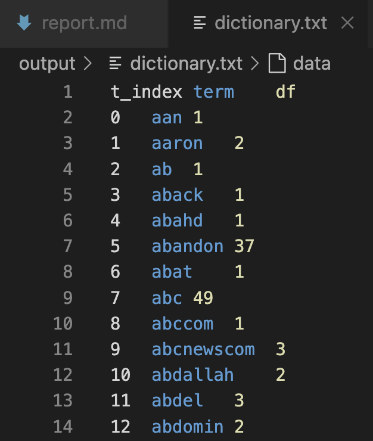

## Step 4 計算 Inversed Document Frequency(IDF)

透過 numpy 內建的方法計算 idf。

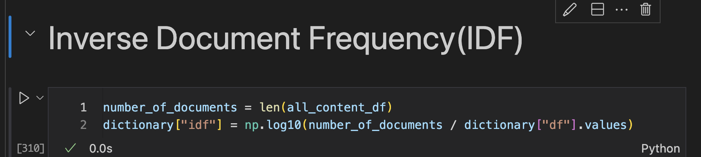

## Step 5 計算 TF-IDF

將所有文章一篇篇抓出來，並去掉文章中重複的 term 只留下 unique 的 term 作為 key。然後將這些 key 一個個使用 count 函式得到原來的文章中這個 term 的數量，之後除以文章 term 的總數做標準化。做完標準化後就有這個 term 的 tf 值，隨後在將 tf 乘以該 term 的 idf 值，就得到在第一篇文章中這個 term 的 tf-idf 值。將其他的 term 重複上述步驟後就能得到這個文章的 tf-idf vector，最後再把 tf-idf vector 除以向量長度，就能得到 tf-idf unit vector 。最後把他輸出成檔案，如下圖二，為第一篇文章的 tf-idf unit vector。

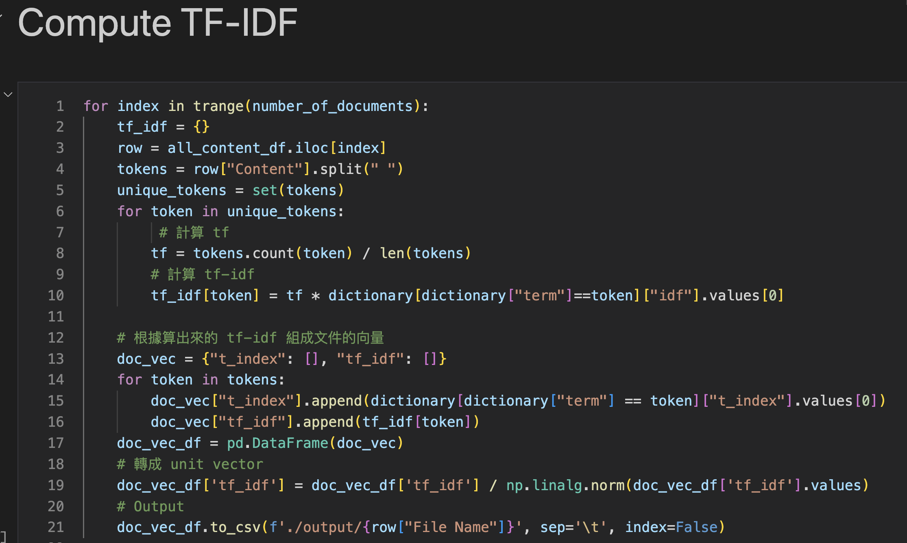

t_index 為該 term 在 dictionary 中的序號，後方則為該 term 的 tf-idf 值。

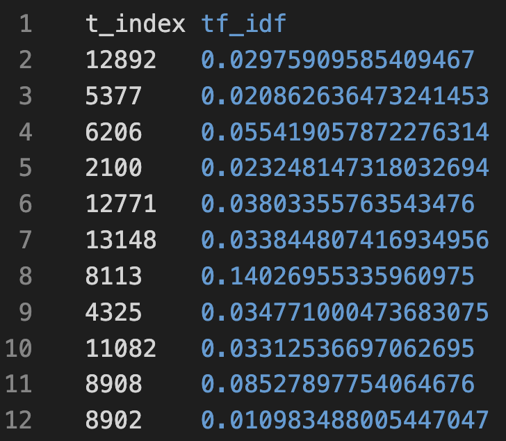

## Step 6 計算 Cosine Similarity

將想要計算的檔案名字設定好之後，就會進入到 function。將檔案內容讀進來後，再與 dictionary 透過 t_index 進行合併，因此在 dictionary 中有匹配到的 term 會有 tf-idf 值，而沒有匹配到的 term 就代表它不存在於該文章當中，因此 tf-idf 的值會是 NaN。透過 pandas 的 fillna 方法可以把 NaN 的值轉換成 0 方便之後計算。在合併之前我把文章中 t_index 有重複的資料移除了，因為重複的資料會導致合併過後的資料量不一致。在經過上述處理過後就會得到兩個文章的 vector，其大小為皆為 dictionary size，其中，文章中有該 term 的位置會被填入 tf-idf 值，而不存在在文章中的 term 的位置則會被填入 0。最後就可以進行 conine similarity 計算，在這邊使用 numpy 提供的方法來進行計算。

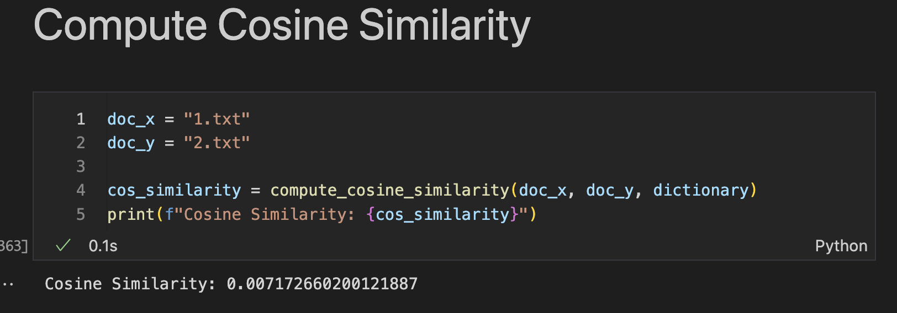

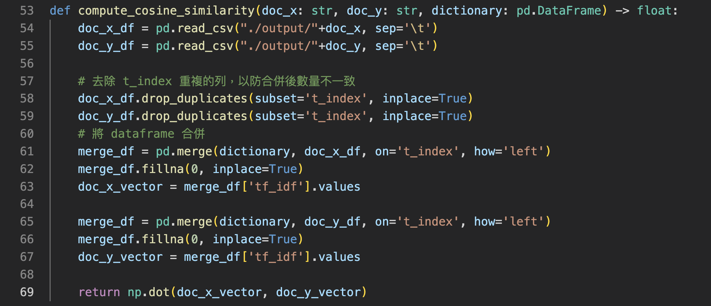
